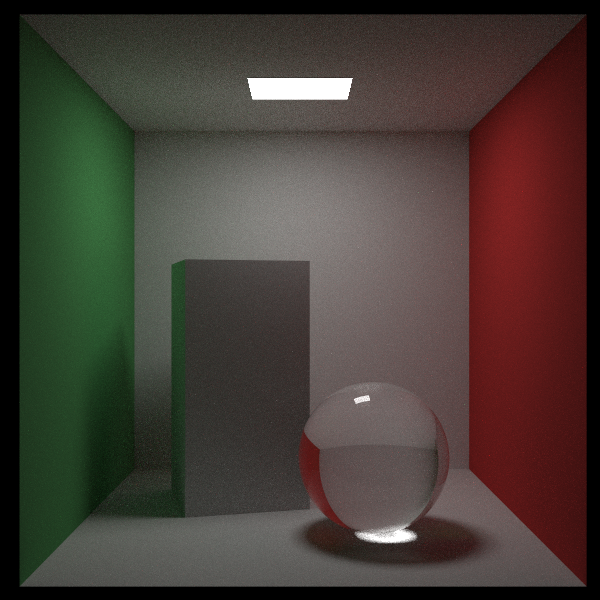

# raytracing

Implementation of the [Ray Tracing in One Weekend](https://raytracing.github.io/) series in Rust.

The final rendering at the end of [Ray Tracing: The Rest of Your Life](https://raytracing.github.io/books/RayTracingTheRestOfYourLife.html) generated from this program.
